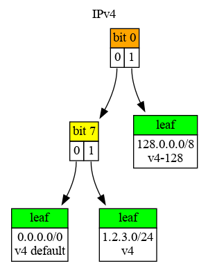
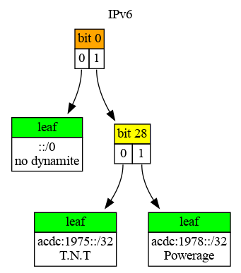

# Iptrie

[](https://github.com/hertogp/iptrie/actions/workflows/elixir.yml)
[](https://hex.pm/packages/iptrie)
[](https://hexdocs.pm/iptrie/)
[](https://hex.pm/packages/iptrie)
[](https://github.com/hertogp/iptrie/blob/master/LICENSE)
[](https://github.com/hertogp/iptrie/commits/master)

<!-- @MODULEDOC -->

IP lookup, with longest prefix match, for IPv4, IPv6 prefixes (and others).

Iptrie manages multiple `Radix` trees, one for each type of prefix used as
determined by their `maxlen` property after encoding it as a `t:Pfx.t/0`
struct.  That way, IPv4 prefixes (`maxlen: 32`) use a different radix tree as
opposed to IPv6 (`maxlen: 128`) or other types.

Iptrie has a bias towards IPv4, IPv6, EUI-48 and EUI-64, since it uses `Pfx` to
convert arguments to a `t:Pfx.t/0` struct.  Other types of prefixes will
require the actual `t:Pfx.t/0` structs as arguments for the various Iptrie
functions.

Like `Pfx`, Iptrie tries to mirror the representation of results to the
arguments given, if possible.

## IPv4/IPv6

    iex> ipt = new()
    ...> |> put("1.2.3.0/24", "v4")
    ...> |> put("128.0.0.0/8", "v4-128")
    ...> |> put("acdc:1975::/32", "T.N.T")
    ...> |> put("acdc:1978::/32", "Powerage")
    ...> |> put("0.0.0.0/0", "v4 default")
    ...> |> put("::/0", "no dynamite")
    iex>
    iex> # 3 longest prefix matches that find the same prefix
    iex> lookup(ipt, "1.2.3.128")
    {"1.2.3.0/24", "v4"}
    iex> lookup(ipt, {{1, 2, 3, 128}, 32})
    {{{1, 2, 3, 0}, 24}, "v4"}
    iex>
    iex> lookup(ipt, %Pfx{bits: <<1, 2, 3, 128>>, maxlen: 32})
    {%Pfx{bits: <<1, 2, 3>>, maxlen: 32}, "v4"}
    iex>
    iex> lookup(ipt, "acdc:1975::")
    {"acdc:1975:0:0:0:0:0:0/32", "T.N.T"}
    iex>
    iex> # separate trees, separate default "routes"
    iex> lookup(ipt, "10.11.12.13")
    {"0.0.0.0/0", "v4 default"}
    iex> lookup(ipt, "abba::")
    {"0:0:0:0:0:0:0:0/0", "no dynamite"}
    iex>
    iex> # visualize the IPv4 & IPv6 radix trees
    iex> kv32 = fn {k, v} -> "#{Pfx.new(k, 32)}<br/>#{v}" end
    iex> radix(ipt, 32)
    ...> |> Radix.dot(label: "IPv4", kv_tostr: kv32)
    ...> |> (&File.write("img/ipv4.dot", &1)).()
    iex> kv128 = fn {k, v} -> "#{Pfx.new(k, 128)}<br/>#{v}" end
    iex> radix(ipt, 128)
    ...> |> Radix.dot(label: "IPv6", kv_tostr: kv128)
    ...> |> (&File.write("img/ipv6.dot", &1)).()


The radix trees in the example above look like this:

 

## Others

Iptrie can also be used to do longest prefix match lookup for other types of
prefixes, like e.g. MAC addresses:

    iex> ipt = new()
    ...> |> put("00-22-72-00-00-00/24", "American Micro-Fuel Device")
    ...> |> put("00-d0-ef-00-00-00/24", "IGT")
    ...> |> put("08-61-95-00-00-00/24", "Rockwell Automation")
    iex>
    iex> lookup(ipt, "00-d0-ef-aa-bb-cc")
    {"00-D0-EF-00-00-00/24", "IGT"}
    iex>
    iex> # longest match for partial prefix
    iex> lookup(ipt, "08-61-95-11-22-00/40") |> elem(1)
    "Rockwell Automation"
    iex>
    iex> kv48 = fn {k, v} -> "#{Pfx.new(k, 48)}<br/>#{v}" end
    iex> radix(ipt, 48)
    ...> |> Radix.dot(label: "MAC OUI", kv_tostr: kv48)
    ...> |> (&File.write("img/mac.dot", &1)).()


`Iptrie` recognizes EUI-48 and EUI-64 prefixes.  Note that EUI-64 using ':' as
punctuation might come out as an IPv6, in which case `Pfx.from_mac/1` should be
used to create a prefix before putting it in the trie.

Since prefixes are stored in specific radix trees based on the `maxlen` of
given prefix, you could also mix IPv4, IPv6, EUI-48, EUI-64 prefixes and
possibly others, in a single Iptrie.

## Examples

Summarize an Iptrie containing a list of full length prefixes within a /24,
with 1 missing address:

    iex> new(for x <- 0..255, do: {"1.1.1.#{x}", x})
    ...> |> delete("1.1.1.128")
    ...> |> prune(fn _ -> {:ok, 0} end, recurse: true)
    ...> |> to_list()
    ...> |> Enum.map(fn {pfx, _v} -> {"#{pfx}", "Range #{Pfx.first(pfx)} - #{Pfx.last(pfx)}"} end)
    [
      {"1.1.1.0/25",   "Range 1.1.1.0 - 1.1.1.127"},
      {"1.1.1.129",    "Range 1.1.1.129 - 1.1.1.129"},
      {"1.1.1.130/31", "Range 1.1.1.130 - 1.1.1.131"},
      {"1.1.1.132/30", "Range 1.1.1.132 - 1.1.1.135"},
      {"1.1.1.136/29", "Range 1.1.1.136 - 1.1.1.143"},
      {"1.1.1.144/28", "Range 1.1.1.144 - 1.1.1.159"},
      {"1.1.1.160/27", "Range 1.1.1.160 - 1.1.1.191"},
      {"1.1.1.192/26", "Range 1.1.1.192 - 1.1.1.255"}
    ]

Find the more specific entries in an Iptrie for a given search prefix

    iex> new()
    ...> |> put("acdc:1975::/32", "TNT")
    ...> |> put("acdc:1977::/32", "LTBR")
    ...> |> put("abba:1975::/32", "RING")
    ...> |> more("acdc::/16")
    ...> |> Enum.map(fn {p, v} -> {"#{p}", v} end)
    [
       {"acdc:1977:0:0:0:0:0:0/32", "LTBR"},
       {"acdc:1975:0:0:0:0:0:0/32", "TNT"}
    ]

Find the less specific entries in an Iptrie for a given search prefix

    iex> new()
    ...> |> put("1.1.1.0/24", 0)
    ...> |> put("1.1.1.0/25", 1)
    ...> |> put("1.1.1.0/26", 2)
    ...> |> put("1.1.1.0/30", 3)
    ...> |> put("1.1.1.128/25", 4)
    ...> |> less("1.1.1.3")
    ...> |> Enum.map(fn {pfx, v} -> {"#{pfx}", v} end)
    [
      {"1.1.1.0/30", 3},
      {"1.1.1.0/26", 2},
      {"1.1.1.0/25", 1},
      {"1.1.1.0/24", 0}
    ]


<!-- @MODULEDOC -->

## Installation

[Iptrie](https://hexdocs.pm/iptrie) can be installed by adding `:iptrie` to your
list of dependencies in `mix.exs`:

```elixir
def deps do
  [
    {:iptrie, "~> 0.5.0"}
  ]
end
```

## Copyright and License

Copyright (c) 2021 hertogp

The source code is licensed under the [MIT License](./LICENSE.md).
