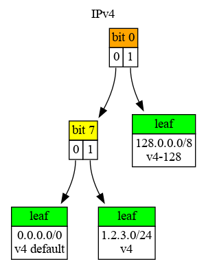
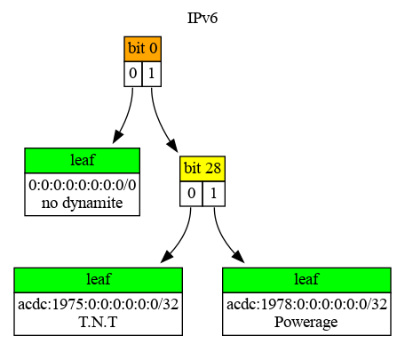
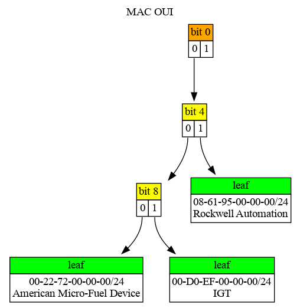

# README


[Online Documentation](https://hexdocs.pm/iptrie).

<!-- @MODULEDOC -->

IP lookup, with longest prefix match, for IPv4, IPv6 prefixes (and others).

Iptrie manages multiple `Radix` trees, one for each type of
`t:Pfx.t/0` prefix used as determined by their `maxlen` property.  That way,
IPv4 prefixes (`maxlen: 32`) use a different radix tree as opposed to e.g. IPv6
(`maxlen: 128`).

Iptrie has a bias towards IPv4 and IPv6 since it uses `Pfx` to convert
arguments to a `t:Pfx.t/0` struct.  So, doing other types of prefixes will
require the actual `t:Pfx.t/0` structs as arguments for the various Iptrie
functions.

Like `Pfx`, Iptrie tries to mirror the representation of results to the
argument(s) given, if possible.

## IPv4/IPv6

    iex> ipt = new()
    ...> |> put("1.2.3.0/24", "v4")
    ...> |> put("128.0.0.0/8", "v4-128")
    ...> |> put("acdc:1975::/32", "T.N.T")
    ...> |> put("acdc:1978::/32", "Powerage")
    ...> |> put("0.0.0.0/0", "v4 default")
    ...> |> put("::/0", "no dynamite")
    iex>
    iex> lookup(ipt, "1.2.3.128")
    {"1.2.3.0/24", "v4"}
    iex> lookup(ipt, "acdc:1975::")
    {"acdc:1975:0:0:0:0:0:0/32", "T.N.T"}
    iex>
    iex> # separate trees, separate default routes
    iex> lookup(ipt, "10.11.12.13")
    {"0.0.0.0/0", "v4 default"}
    iex> lookup(ipt, "abba::")
    {"0:0:0:0:0:0:0:0/0", "no dynamite"}
    iex>
    iex> # visualize the IPv4 & IPv6 radix trees
    iex> kv32 = fn {k, v} -> "#{Pfx.new(k, 32)}<br/>#{v}" end
    iex> radix(ipt, 32)
    ...> |> Radix.dot(label: "IPv4", kv_tostr: kv32)
    ...> |> (&File.write("img/ipv4.dot", &1)).()
    iex> kv128 = fn {k, v} -> "#{Pfx.new(k, 128)}<br/>#{v}" end
    iex> radix(ipt, 128)
    ...> |> Radix.dot(label: "IPv6", kv_tostr: kv128)
    ...> |> (&File.write("img/ipv6.dot", &1)).()


Where the radix trees for the IP prefixes look like:

 

## Others

Iptrie can also be used to do longest prefix match lookup for other types of
prefixes, like e.g. MAC addresses:

    iex> ipt = new()
    ...> |> put(%Pfx{bits: <<0x00, 0x22, 0x72>>, maxlen: 48}, "American Micro-Fuel Device")
    ...> |> put(%Pfx{bits: <<0x00, 0xd0, 0xef>>, maxlen: 48}, "IGT")
    ...> |> put(%Pfx{bits: <<0x08, 0x61, 0x95>>, maxlen: 48}, "Rockwell Automation")
    iex>
    iex> lookup(ipt, %Pfx{bits: <<0x00, 0xd0, 0xef, 0xaa, 0xbb>>, maxlen: 48})
    {%Pfx{bits: <<0x00, 0xd0, 0xef>>, maxlen: 48}, "IGT"}
    iex>
    iex> # longest match for partial prefix
    iex> lookup(ipt, %Pfx{bits: <<0x08, 0x61, 0x95, 0x01>>, maxlen: 48}) |> elem(1)
    "Rockwell Automation"
    iex>
    iex> kv48 = fn {_k, v} -> "#{v}" end
    iex> radix(ipt, 48)
    ...> |> Radix.dot(label: "MAC OUI", kv_tostr: kv48)
    ...> |> (&File.write("img/mac.dot", &1)).()



`Iptrie` does not automatically recognize MAC addresses in string format (like
`00-D0-EF-AA-BB-CC-DD-EE` or `00:D0:EF:AA:BB:CC:DD:EE`), so the actual
`t:Pfx.t/0` structs must be used in the various IPtrie functions.

Since prefixes are stored in specific radix trees based on the `maxlen` of
given prefix, you could also mix IPv4, IPv6 and MAC prefixes and possibly
others, in a single Iptrie.

<!-- @MODULEDOC -->

## Installation

[Iptrie](https://hexdocs.pm/iptrie) can be installed by adding `iptrie` to your
list of dependencies in `mix.exs`:

```elixir
def deps do
  [
    {:iptrie, "~> 0.2.0"}
  ]
end
```

Repositiory is on [github](https://github.com/hertogp/iptrie).

